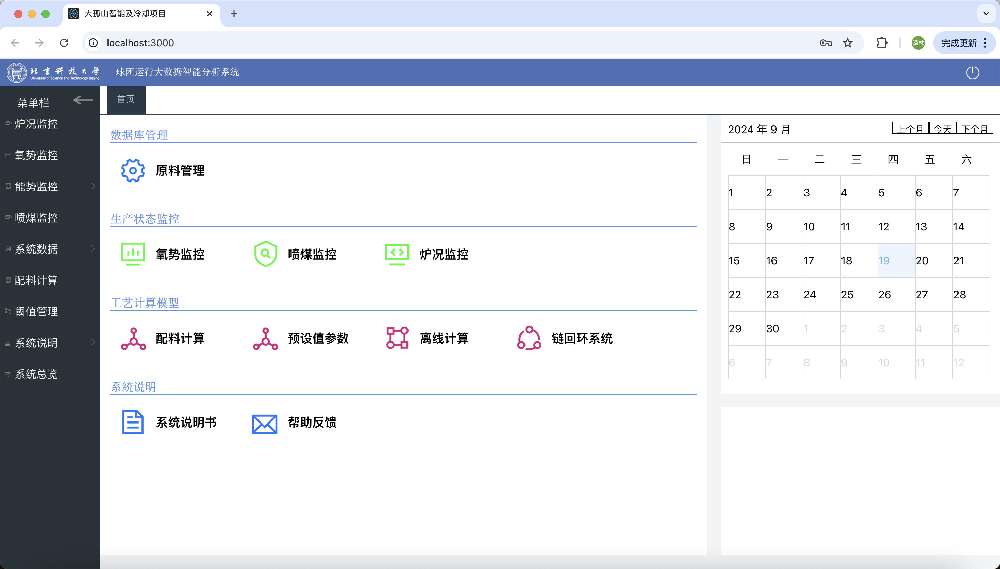
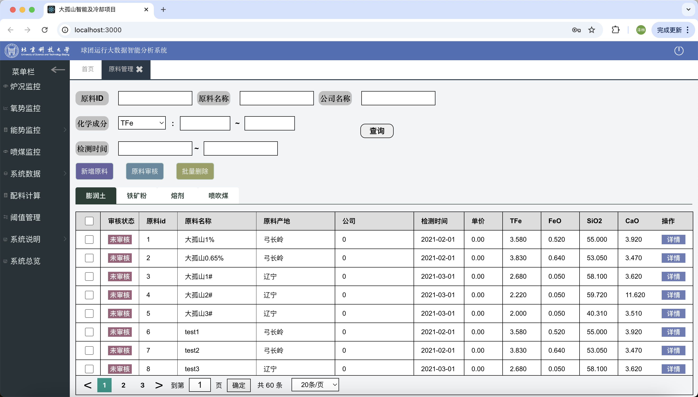
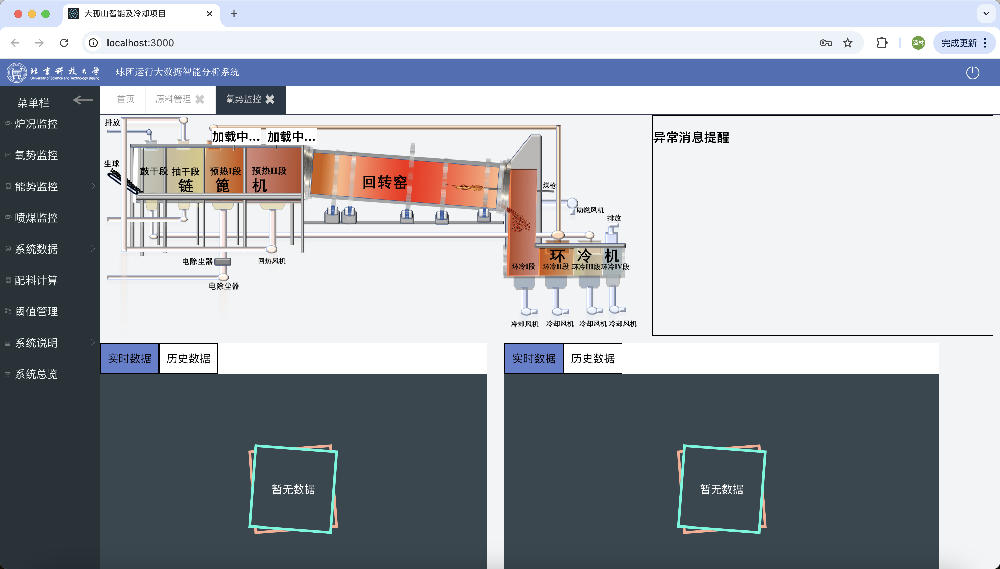
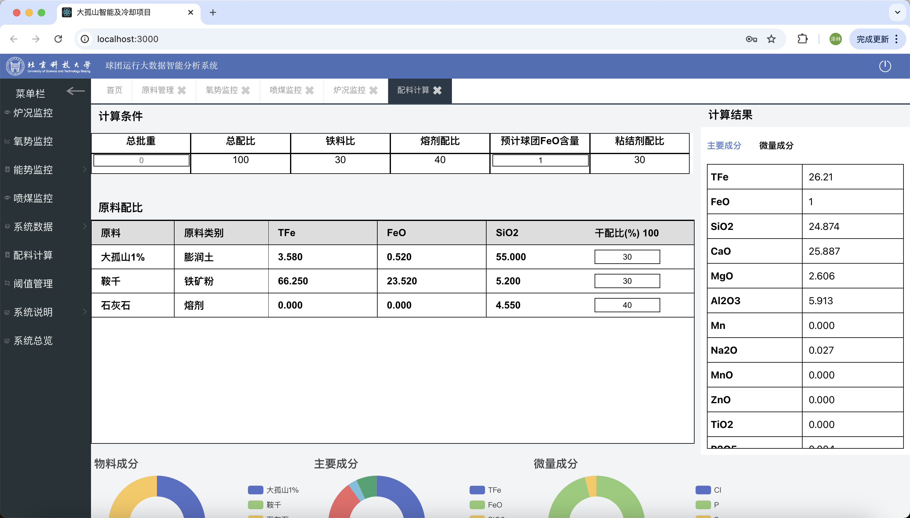
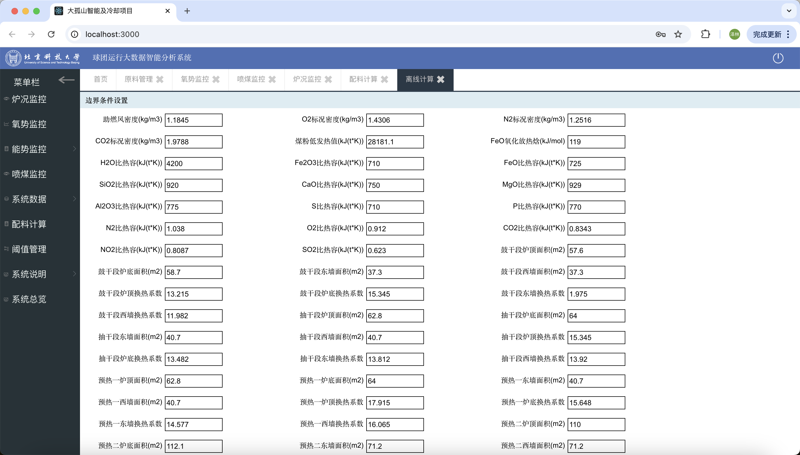

# 球团项目网站
## 服务器端
```
cd server
npm run install
node index.js
```

## 客户端
```
cd client
npm run install
npm run start
```

## 数据库
```SQL
CREATE DATABASE DaGuShan;
USE DaGuShan;

-- 运行`database`文件夹里的 `DaGuShandef.sql` 和 `DaGuShandata.sql`
```

## 几个主要的页面







